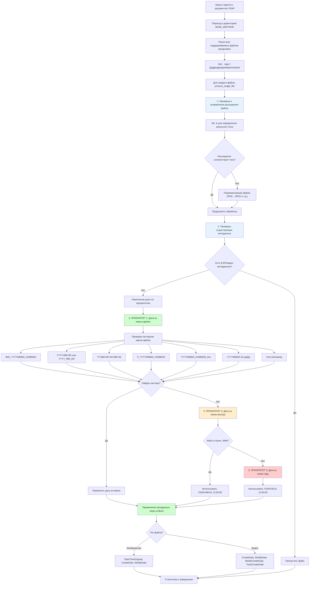

# Логика скрипта fix_exif_dates_new.sh

## Обзор
Скрипт обрабатывает фото и видео файлы в указанной папке года, устанавливая EXIF/метаданные дат на основе приоритетной логики извлечения дат.

## Архитектура скрипта



## Детальная логика обработки

### 1. Проверка и исправление расширений файлов
- Использует команду `file -b` для определения реального типа файла
- Автоматически переименовывает файлы с неправильными расширениями:
  - PNG файл с содержимым JPEG → переименование в .jpg
  - Аналогично для других несоответствий
- Поддерживаемые типы:
  - **Изображения**: JPEG, PNG, WebP, TIFF, GIF
  - **Видео**: MP4, QuickTime/MOV

### 2. Проверка существующих метаданных
- **Для изображений**: проверяет наличие `DateTimeOriginal`
- **Для видео**: проверяет `CreateDate`, `MediaCreateDate`, `TrackCreateDate`
- Если метаданные уже есть → файл пропускается

### 3. Приоритетная система извлечения дат

#### ПРИОРИТЕТ 1: Паттерны в имени файла (от высшего к низшему)
1. **IMG_YYYYMMDD_HHMMSS** → `IMG_20241225_143022.jpg`
2. **YYYY-MM-DD или YYYY_MM_DD** → `2024-12-25_photo.jpg`
3. **YY-MM-DD HH-MM-SS** → `24-12-25 14-30-22.jpg`
4. **P_YYYYMMDD_HHMMSS** → `P_20241225_143022.jpg`
5. **YYYYMMDD_HHMMSS_lmc** → `20241225_143022_lmc.jpg`
6. **YYYYMMDD (8 цифр)** → `20241225.jpg`
7. **Unix timestamp** → `1703512800.jpg`

#### ПРИОРИТЕТ 2: Папка месяца
- Если файл находится в папке `./MM/` (например, `./12/`)
- Устанавливает дату: `YEAR:MM:01 12:00:00`
- Пример: файл в `./12/` получает дату `2024:12:01 12:00:00`

#### ПРИОРИТЕТ 3: Папка года (fallback)
- Если не найдено других источников даты
- Устанавливает дату: `YEAR:06:01 12:00:00`
- Пример: `2024:06:01 12:00:00`

### 4. Применение метаданных

#### Для изображений:
```bash
exiftool -overwrite_original \
  "-DateTimeOriginal=$date_str" \
  "-CreateDate=$date_str" \
  "-ModifyDate=$date_str" \
  "$file"
```

#### Для видео:
```bash
exiftool -overwrite_original \
  "-CreateDate=$date_str" \
  "-ModifyDate=$date_str" \
  "-MediaCreateDate=$date_str" \
  "-TrackCreateDate=$date_str" \
  "$file"
```

## Ключевые особенности

### Валидация данных
- Проверка корректности извлеченных дат
- Валидация компонентов даты (месяц 1-12, день 1-31, час 0-23, и т.д.)
- Проверка года в разумных пределах (1900-2100)

### Обработка ошибок
- Graceful handling неподдерживаемых типов файлов
- Логирование ошибок переименования и применения метаданных
- Подсчет статистики: успешные, неудачные, пропущенные файлы

### Режим dry-run
- Поддержка флага `--dry-run` для тестирования без изменений
- Показывает, какие операции будут выполнены

### Рекурсивная обработка
- Обрабатывает все файлы в указанной папке года и всех подпапках
- Использует `find` с фильтрацией по расширениям файлов

## Использование

```bash
# Обычный режим
./fix_exif_dates_new.sh 2024

# Режим тестирования
./fix_exif_dates_new.sh 2024 --dry-run
```

## Статистика выполнения
Скрипт выводит подробную статистику:
- Общее количество обработанных файлов
- Успешно обновленные файлы
- Файлы с ошибками обработки
- Пропущенные файлы (уже имеют метаданные)

## Команды для верификации
```bash
# Проверка EXIF дат изображений
exiftool -r -DateTimeOriginal -s -s -s . | head -20

# Проверка дат создания
exiftool -r -CreateDate -s -s -s . | head -20
```